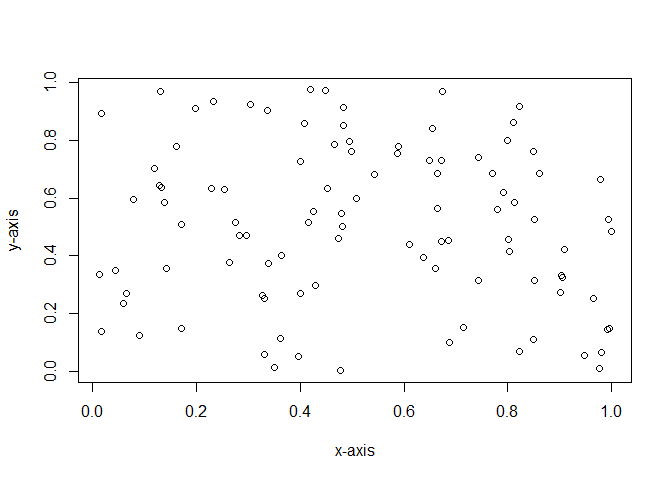

A Mini-Introduction to R Markdown
---------------------------------

Markdown documents are text files that contain a mixture of standard
prose and programming code that can be easily be rendered as HTML or PDF
outputs. During this rendering process, any code blocks are run and the
results embedded in the output document. This can be really useful for
making figures and tables to help describe a data set and to document
analyses. [R markdown](https://rmarkdown.rstudio.com/) is a flavour of
markdown that interfaces with the [R statistical
platform](https://www.r-project.org/).

Code can included in R markdown documents in ‘chunks’ such as the one
shown below:

However, you will only see this code chunk in the original markdown
text. At the top of the code chunk you will see the line `input=FALSE`.
This means that the code is run but that neither the code itself or the
results of the code is printed when rendering the document to HTML or
any other output format. This is useful when you want to set up things
in the background that you don’t want rendered into the document. In
this example the code chunk above calls the libraries that our markdown
document will use so we don’t need to have that code rendered to the
HTML output. We can also make the code chunks print to the rendered
document by removing the `include=FALSE` term. Sometimes, you might only
want the result to be created in the rendered document. For example,
when producing figures, we often do not want the code that produces the
figure in the rendered document, just the figure itself. By setting
`echo=FALSE` in the code chunk options then the code itself will not be
rendered in the output document. For example the code chunk below will
appear as code in the markdown document but will be replaced by a figure
in the rendered document.

The easiest way to render this document is to open it in
[RStudio](https://www.rstudio.com/) and then click on the ‘Knit’ button
that is in the top left-hand corner. A rendered version of the document
is then opened in a browser.

We can also call R functions ‘inline’. For example in the markdown
version of the document the term: 4 appears as ‘r 2+2’ but, in the
rendered version, R is called and the calculation is performed. The
statement is then replaced by the output (in this case ‘4’). A full
introduction to R markdown is beyond the scope of this document but
there are number of [great
resources](https://bookdown.org/yihui/rmarkdown/) to learn more.

When using markdown to describe the metadata of the project we can use a
number of functions described in the Living Norway package to help flag
sections of text that we want to export as information to appear in an
EML file. The code chunk below will allow you to see flagged sections of
text being rendered in a red colour in HTML output. For normal
descriptions of metadata you would not want this so you should delete
this code chunk for your own metadata descriptions.

    span.LNmetadata {
      color: red;
    }

The Dataset
-----------

Metadata must have a dataset tag. We give this tag an ID and it serves
as a parent ID for a lot of other tags that describe the dataset. Often
we don’t want to print any text associated with this tag to the output
so we can therefore set the `isHidden` argument to `TRUE` so that the
tag is invisible in the rendered output. The main purpose of calling
this function is to set an ID for the dataset tag that can be used to
relate other things to it (here we have used the ID ‘TOVEDataset’). In
the dataset function we can also give information on the title to use in
the dataset through the `title.tagText` argument.

TOV-E Bird monitoring sampling
data

We can also associate some keywords with the dataset. To do this we can
set up a ‘keywordSet’ tag using the relevant tagging function

and then specifying keywords such as breeding birds and sampling event.

We must also specify some contact information for the individual or
organisation responsible for coordinating with users of the dataset.
Here the responsible user is

John Atle Kålås.

Abstract
--------

We will need to produce an abstract for the data. You can flag the
abstract for export to EML using the following inline code:

Data
from the project: “Extensive monitoring of breeding birds (TOV-E)” from
2006 up until today. The project is carried out in cooperation between
NOF BirdLife Norway, Norwegian Institute for Nature Research (NINA) and
Norwegian Environment Agency, and is the most important project for
monitoring population trends for Norwegian bird species on land.

The Living Norway package will also allow for alternative translations
of EML elements. In the inline code above we set the tagID argument. We
can provide an alternative translation for the element with that tagID
using the following code:

Data fra
prosjektet “Ekstensiv overvåking av hekkefugl (TOV-E)” fra 2006 og frem
til i dag. Prosjektet utføres i samarbeid mellom Norsk Ornitologisk
Forening, Norsk Institutt for Naturforskning og Miljødirektoratet og er
det viktigste prosjektet for å overvåke populasjonstrender for norske
fuglearter på land.

By default, alternative translations are hidden in rendered HTML output.
The information is still there but it is not displayed when being opened
by a browser. This is useful when you want information to be exported to
the EML file but do not to display them in the rendered HTML. If you
would rather the alternative translation be displayed, then you can add
the argument `isHidden=FALSE` to the `LNaddTranslation` function.

Dataset creators
----------------

The dataset was created by the following people:

-   John Atle Kålås who is a senior researcher at the Norwegian Institute for Nature Research
    (<a href="mailto:john.kalas@nina.no" class="email">john.kalas@nina.no</a>).
-   Ingar Jostein Øien who is a fagsjef at the Norsk Ornitologisk Forening (<a href="mailto:ingar@birdlife.no" class="email">ingar@birdlife.no</a>).
-   Bård Stokke who is a senior researcher at the Norwegian Institute for Nature Research
    (<a href="mailto:bard.stokke@nina.no" class="email">bard.stokke@nina.no</a>).
-   Roald Vang who is a data manager at the Norwegian Institute for Nature Research
    (<a href="mailto:roald.vang@nina.no" class="email">roald.vang@nina.no</a>).
